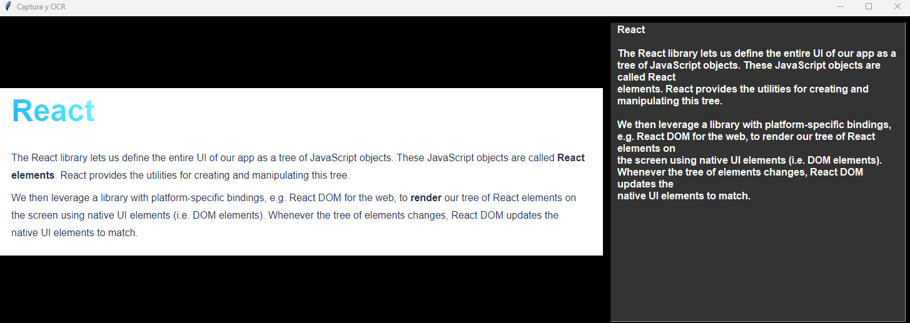

# Screen Capture and OCR Project Documentation
<p align="center">
  
</p>

## General Description
This project allows the user to capture a specific section of the screen using a combination of keys and then process that capture to extract text via OCR (Optical Character Recognition). The application consists of three main components: screen capture, OCR processing, and a graphical interface to display the results.

## Files and Modules

### `captura.py`
This module handles screen capture.
- **Function `capturar_pantalla`**:
  - Activated with the `Ctrl` + `Print Screen` key combination.
  - Allows the user to select an area of the screen with the mouse.
  - Captures and returns the selected section.

### `ocr.py`
This module is responsible for optical character recognition.
- **Function `extraer_texto`**:
  - Receives the path of an image.
  - Uses `pytesseract` to extract text from the image.
  - Returns the extracted text.

### `main.py`
The main script that combines the capture and OCR modules.
- **Function `main`**:
  - Executes a loop that awaits screen capture activation.
  - Displays the results in a graphical interface.

## This code uses the Tesseract OCR library
Before running this code, make sure to install Tesseract by following the instructions on this page:
https://github.com/UB-Mannheim/tesseract/wiki

## Project Requirements

The `requirements.txt` file contains all the necessary libraries to run the screen capture and OCR project. To install these dependencies, execute the following command in your Python environment: 
```console
pip install -r requirements.txt
```
 or alternatively write `pip install -r` and drag the `requirements.txt` file to the console.

## Package description
- `pyautogui`: Used for GUI automation and screen capture.
- `keyboard`: For registering key combinations.
- `opencv-python`: An image processing library, used here for handling images in OCR.
- `pytesseract`: Python interface for Tesseract-OCR for performing optical character recognition.
- `Pillow`: Python Imaging Library, necessary for image handling.
- `tkinter`: Graphical User Interface library, used for displaying results.

### Note:
`tkinter` usually comes pre-installed with Python, so it's not necessary to install it in most cases.

### Example

